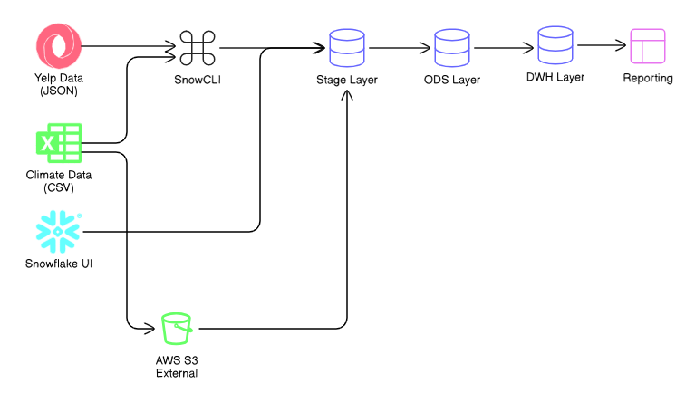
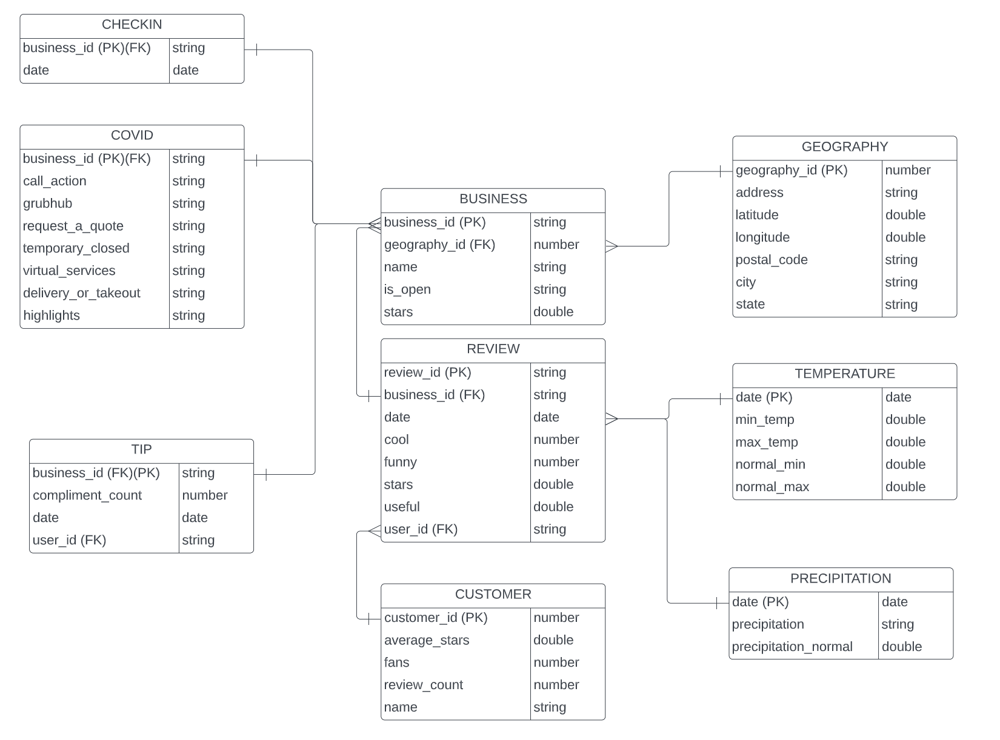

# Weather Warehousing Project

A comprehensive **data warehousing solution** that integrates **Yelp business data** with **climate information** to enable **weather-based business analytics**.

---

## 📑 Table of Contents

* [Overview](#overview)
* [Project Architecture](#project-architecture)
* [Database Schema](#database-schema)
* [Tech Stack](#tech-stack)
* [Data Sources](#data-sources)
* [Implementation Details](#implementation-details)

  * [Data Ingestion Methods](#data-ingestion-methods)
  * [Data Pipeline Stages](#data-pipeline-stages)
* [Setup Instructions](#setup-instructions)
* [File Structure](#file-structure)
* [Challenges & Solutions](#challenges--solutions)
* [Future Enhancements](#future-enhancements)
* [Contributors](#contributors)
* [License](#license)
* [Acknowledgments](#acknowledgments)

---

## 🎯 Overview

This project implements a **modern data warehouse** that combines business data from Yelp with climate data to provide insights into how **weather patterns impact business performance**, **customer behavior**, and **reviews**.
It uses **Snowflake** as the data warehouse platform and follows a **multi-stage ETL pipeline** approach.

### 🔍 Key Features

* **Multi-source integration**: Combines JSON (Yelp) and CSV (Climate) data
* **Scalable architecture**: Capable of handling GB-sized datasets
* **Three-tier architecture**: Stage → ODS → DWH
* **Optimized ingestion**: Multiple data loading methods for efficiency
* **Analytical insights**: Enables weather-business correlation studies

---

## 🏗️ Project Architecture


---

## 📊 Database Schema

### Entity Relationship Diagram (ERD)


---

## 🛠️ Tech Stack

* **Data Warehouse:** Snowflake
* **Cloud Storage:** AWS S3
* **ETL Tools:**

  * SnowCLI (for large file uploads)
  * Snowflake UI (for smaller files)
* **Data Formats:** JSON, CSV
* **Language:** SQL

---

## 📁 Data Sources

### 🗂️ Yelp Dataset

* **Format:** JSON
* **Content:** Business details, reviews, tips, check-ins, and COVID adaptations
* **Size:** Multiple GB files
* **Source:** Yelp Open Dataset

### 🌦️ Climate Explorer Dataset

* **Format:** CSV
* **Content:** Temperature and precipitation data
* **Source:** Climate Explorer
* **Coverage:** Historical weather data

---

## 🔧 Implementation Details

### Data Ingestion Methods

We used **three ingestion methods** depending on file size and upload strategy:

#### 1. SnowCLI Method (Files > 250MB)

```bash
# Install SnowCLI
pip install snowflake-cli

# Configure connection
snow connection create

# Upload large files
snow stage copy @my_stage local_file.json
```

#### 2. Snowflake UI Method (Files < 250MB)

* Used **Snowflake Web UI** for smaller dataset uploads
* Simple and quick for light data ingestion

#### 3. AWS S3 External Stage Method

```sql
-- Create storage integration
CREATE STORAGE INTEGRATION s3_integration
  TYPE = EXTERNAL_STAGE
  STORAGE_PROVIDER = S3
  ENABLED = TRUE
  STORAGE_AWS_ROLE_ARN = 'arn:aws:iam::xxx:role/snowflake_role'
  STORAGE_ALLOWED_LOCATIONS = ('s3://my-bucket/path/');

-- Create external stage
CREATE STAGE my_s3_stage
  STORAGE_INTEGRATION = s3_integration
  URL = 's3://my-bucket/path/';
```

---

### Data Pipeline Stages

#### **1. Stage Layer**

* Acts as a raw data landing zone
* No transformations applied
* Retains original structure and file format

#### **2. ODS (Operational Data Store) Layer**

* Performs basic data cleaning
* Standardizes data types
* Removes duplicates and nulls

#### **3. DWH (Data Warehouse) Layer**

* Contains fully transformed data
* Organized into **fact** and **dimension** tables
* Optimized for analytics and reporting

---

## 📋 Setup Instructions

### Prerequisites

* Snowflake account
* AWS account (for S3 method)
* SnowCLI installed
* Access to Yelp and Climate datasets

### Installation Steps

1. **Clone the Repository**

```bash
git clone https://github.com/yourusername/weather-warehousing-project.git
cd weather-warehousing-project
```

2. **Set up Snowflake Environment**

```sql
CREATE WAREHOUSE weather_wh WITH WAREHOUSE_SIZE = 'MEDIUM';
CREATE DATABASE weather_dwh;
CREATE SCHEMA stage;
CREATE SCHEMA ods;
CREATE SCHEMA dwh;
```

3. **Create Stages**

```sql
-- Internal stage for smaller files
CREATE STAGE weather_dwh.stage.internal_stage;

-- External stage for AWS S3
CREATE STAGE weather_dwh.stage.external_stage
  URL = 's3://your-bucket/'
  STORAGE_INTEGRATION = s3_integration;
```
---

## 📂 File Structure

```
weather-warehousing-project/
│
├── README.md
│
├── scripts/
│   ├── json_to_stage.sql
│   ├── csv_to_stage.sql
│   ├── stage_to_ods.sql
│   ├── ods_to_dwh.sql
│   └── analysis.sql
│
├── img/
│   ├── (This folder contains the images related to this project)
│   
│
└── scripts/
    ├── (This folder contains the CLI Scripts to download, run, and put the files in from snowcli to snowflake stage)
```

---

## 🚧 Challenges & Solutions

### **Challenge 1: Large File Handling**

* **Problem:** Yelp dataset files were extremely large (multiple GBs).
* **Solution:** Implemented three-tier ingestion methods —

  1. **SnowCLI** for files > 250MB
  2. **Snowflake UI** for files < 250MB
  3. **AWS S3 External Stage** for very large datasets

### **Challenge 2: Mixed Data Formats**

* **Problem:** Handling both JSON and CSV data formats.
* **Solution:** Created separate staging tables for each format with proper parsing logic.

### **Challenge 3: Query Performance**

* **Problem:** Initial analytical queries were slow.
* **Solution:** Implemented clustering keys and materialized views in the DWH layer.
  
---

##  Project Summary

In this project, datasets from **Yelp (JSON)** and **Climate Explorer (CSV)** were downloaded and integrated into **Snowflake** to study the relationship between weather and business activity.

The data was processed in three layers:

1. **Stage** — Raw data landing
2. **ODS** — Cleaned and standardized data
3. **DWH** — Final, analytics-ready data

To handle large datasets, three ingestion methods were used:

* **SnowCLI** for files larger than 250MB
* **Snowflake UI** for smaller files
* **AWS S3 external stage** for very large files

This structured ETL process ensures scalability, efficiency, and accurate analytics.

